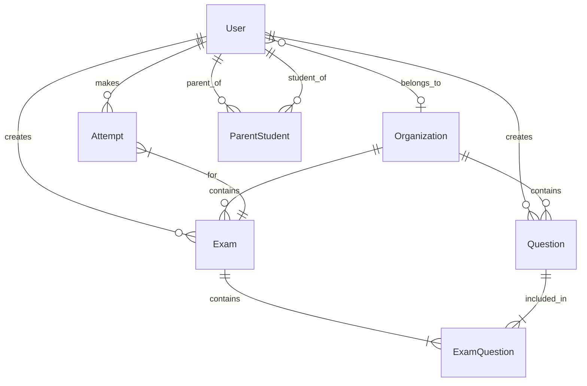

# ExamFlow

[](https://nodejs.org/)
[](https://nestjs.com/)
[](https://nextjs.org/)
[](https://www.postgresql.org/)
[](https://www.typescriptlang.org/)
[](LICENSE)

**A modern exam management platform for teachers and students.**
Create exams, take quizzes, and track performance — all in one place.

## Live Demo

- **Frontend:** _Coming soon_
- **API Docs (Swagger):** `{API_URL}/api-docs`

Demo accounts:
| Role | Email | Password |
|---------|---------------------|----------|
| Teacher | teacher@demo.com | Demo123! |
| Student | student@demo.com | Demo123! |
| Student | student2@demo.com | Demo123! |

## Features

- **Question Bank** — Create 5 question types: multiple choice, multi-select, true/false, fill-in-the-blank, and essay
- **Exam Builder** — Build exams with drag-and-drop ordering, custom point values, and flexible configuration
- **Access Code System** — Share exams via unique 6-character access codes
- **Timed Exams** — Configurable countdown timer with auto-submit on expiration
- **Auto Grading** — Instant scoring for objective questions with partial credit for multi-select
- **Auto-Save** — Answers saved automatically as students work, with resume support
- **Anti-Cheat** — Tab-switch detection, fullscreen enforcement, and activity logging
- **AI Question Generator** — Generate or import questions from PDF, DOCX, or pasted text
- **Spaced Repetition** — SM-2 review queue that automatically adds missed questions
- **Parent Dashboard** — Parent/student linking with progress and review workload summaries
- **Analytics Dashboard** — Score distributions, question-level stats, and weak topic identification
- **Role-Based Access** — Student, Teacher, Org Admin, and Super Admin with fine-grained permissions
- **JWT Auth** — Secure access/refresh token flow with Redis-backed session management

## Architecture

```
┌─────────────────────────────────────────────────────────────┐
│                        Client (Browser)                     │
│                    Next.js 14 (App Router)                  │
│              Zustand + React Query + Tailwind               │
└──────────────────────────┬──────────────────────────────────┘
                           │ HTTP/REST
┌──────────────────────────▼──────────────────────────────────┐
│                     NestJS API Server                       │
│        Auth │ Questions │ Exams │ Attempts │ Analytics       │
│               Guards │ Interceptors │ Filters               │
├─────────────────┬───────────────────┬───────────────────────┤
│   PostgreSQL    │      Redis        │     Prisma ORM        │
│   (Data Store)  │  (Sessions/Cache) │   (Query Builder)     │
└─────────────────┴───────────────────┴───────────────────────┘
```

## Tech Stack

| Layer | Technology | Purpose |
|------------|-------------------------------|-------------------------------------|
| Frontend | Next.js 14 (App Router) | Server/client rendering, routing |
| Styling | Tailwind CSS | Utility-first CSS framework |
| State | Zustand | Client-side state management |
| Data | React Query | Server state & caching |
| Backend | NestJS | REST API framework |
| ORM | Prisma | Type-safe database access |
| Database | PostgreSQL 16 | Relational data storage |
| Cache | Redis 7 | JWT sessions, exam timers |
| Auth | Passport + JWT | Authentication & authorization |
| Validation | class-validator / Zod | Backend / Frontend validation |
| Monorepo | Turborepo + pnpm | Build orchestration |

## Database Schema



## Getting Started

### Prerequisites

- Node.js 20+
- pnpm 8+
- Docker & Docker Compose

### Installation

```bash
# Clone the repository
git clone https://github.com/your-username/examflow.git
cd examflow

# Install dependencies
pnpm install

# Start PostgreSQL & Redis
docker-compose up -d

# Set up environment variables
cp apps/api/.env.example apps/api/.env
cp apps/web/.env.example apps/web/.env

# Run database migrations & seed
cd apps/api
npx prisma migrate dev --name init
npx prisma db seed
cd ../..

# Start development servers
pnpm dev
```

The API runs on `http://localhost:3001` and the frontend on `http://localhost:3000`.

## API Reference

| Method | Endpoint | Description | Auth |
|--------|-------------------------------|--------------------------------------|------|
| POST | /auth/register | Register new user | No |
| POST | /auth/login | Login | No |
| POST | /auth/refresh | Refresh access token | No |
| POST | /auth/logout | Logout | Yes |
| GET | /auth/me | Get current user | Yes |
| GET | /questions | List questions (paginated) | Yes |
| POST | /questions | Create question | Yes* |
| GET | /questions/:id | Get question | Yes |
| PATCH | /questions/:id | Update question | Yes* |
| DELETE | /questions/:id | Delete question | Yes* |
| GET | /exams | List exams | Yes |
| POST | /exams | Create exam | Yes* |
| GET | /exams/:id | Get exam details | Yes |
| GET | /exams/code/:code | Find exam by access code | No |
| PATCH | /exams/:id | Update exam | Yes* |
| PATCH | /exams/:id/publish | Publish exam | Yes* |
| PATCH | /exams/:id/archive | Archive exam | Yes* |
| POST | /exams/:id/questions | Add questions to exam | Yes* |
| DELETE | /exams/:id/questions/:qid | Remove question from exam | Yes* |
| GET | /exams/:id/results | Get exam results | Yes* |
| POST | /attempts | Start attempt | Yes |
| PUT | /attempts/:id/answers | Save answer (auto-save) | Yes |
| POST | /attempts/:id/submit | Submit attempt | Yes |
| GET | /attempts/:id | Get attempt details | Yes |
| GET | /attempts | List my attempts | Yes |
| GET | /analytics/exams/:examId | Exam analytics | Yes* |
| GET | /analytics/me | My learning stats | Yes |
| GET | /health | Health check | No |

_*Requires TEACHER, ORG_ADMIN, or SUPER_ADMIN role_

## Security Features

- **JWT Authentication** — Short-lived access tokens (15m) with Redis-backed refresh tokens (7d)
- **Rate Limiting** — 100 req/15min general, 5 req/15min for auth endpoints
- **Helmet** — HTTP security headers
- **CORS** — Configurable allowed origins
- **Password Policy** — Minimum 8 characters with uppercase and number requirement
- **Input Validation** — Whitelist validation with `forbidNonWhitelisted`
- **Anti-Cheat** — Tab switch detection, fullscreen enforcement, timer enforcement via Redis TTL

## Roadmap

- [x] **Phase 1** — Core exam platform (Auth, Questions, Exams, Attempts, Analytics)
- [x] **Phase 2** — Anti-cheat, AI question generation, review engine, parent dashboard, tests, and API docs polish
- [ ] **Phase 3** — Organization management, bulk operations, advanced reporting
- [ ] **Phase 4** — Mobile app, real-time collaboration, LMS integrations

## License

This project is licensed under the MIT License.
